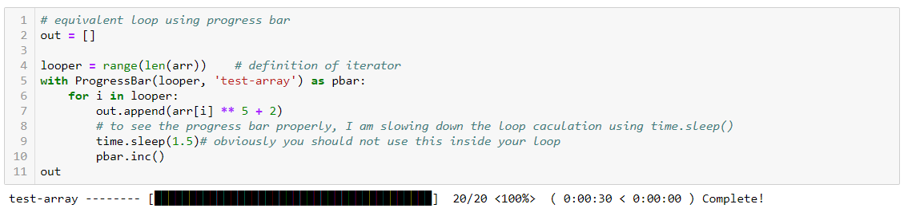

<h1>
  msdlib
</h1>
<br>

[](https://opensource.org/licenses/MIT)
[](https://badge.fury.io/py/msdlib)

<br>
<br>
<br>
<br>


<br>


<h2>
    Introduction
</h2>

This library was first designed for my personal usage for data visualization, processing and machine learning purposes. But then I thought it might help others to do the same things with easier ways. That thought motivated me to make new functions inside the library. Its not yet rich but I am strongly willing to make it much bigger, richer and helpful for all.
<br>


<h2>
    Dependencies
</h2>

This library mostly works on top of pandas, numpy, matplotlib and some other several packages. I am providing a list here-
<li>Numpy</li>
<li>Pandas</li>
<li>Matplotlib</li>
<li>Scipy</li>
<li>Seaborn</li>


Its best to install the most updated versions of these dependencies
<br>


<h2>
  Installation
</h2>

```pip install msdlib```

or if you have --user related issues during installation, please use

```pip install --user msdlib```
<br>


<h2>
    License
</h2>

MIT open source License has been issued for this library.
<br>


<h2>
  Examples
</h2>

You can find easy examples on how to use the functions and classes from this library [here](https://github.com/abdullah-al-masud/msdlib/tree/master/msdlib/examples).
Please download the used data from [here](https://drive.google.com/open?id=15gKhIKcNncteSxJxr0GEC967UwL51l5n).
<br>

<h2>
  Documentation
</h2>

Complete documentation of classes and functions can be found [here](https://github.com/abdullah-al-masud/msdlib/blob/master/docs/DOC.md). The list is alphabetically ordered.
<br>

<h2>
    Overview
</h2>

The whole library can be divided into 4 main portions.

1. Visualization tools
2. Data processing tools
3. Machine learning tools
4. Miscellaneous
<br>

Some of the frequently used programs are shown bellow.


<h2>
    Visualization Tools
</h2>


<h3>
    data_gridplot:
</h3>

Its a function for scatter plots between every pair of features along with distributions (similar to matrix_plot in pandas). But it enables you to save the image, change figure_size, titles etc and also has one special feature for clusters in the data if any.
<br>


<br>
<h3>
    plot_time_series:
</h3>

This is a function and the most useful function for me from all my library functions and classes. It helps to plot time series data with a lot of flexibility. Please check out the example scripts for illustrations and guidance to use it.

<h3>
    plot_heatmap:
</h3>

Flexible heatmap plotter function with options to remove symmetrical triangular side and many other options.

<h3>
    get_color_from_cmap:
</h3>

This function creates colors from a specified matplotlib colormap
<br>
<br>


<h2>
    Data Processing Tools
</h2>


<h3>
    Filters:
</h3>

This is a class defined for applying low pass, high pass, band pass and band stop filters. It also enables us to visualize frequency domain of the signal, designed filter and also let us visualize the filtered signal if we apply a filter on the signal.

<h3>
    get_spectrogram:
</h3>

This is a function that allows us to calculate spectrogram of any time series signal and also plots heatmap for that spectrogram with proper frequency bins and time axis.

<h3>
    grouped_mode:
</h3>

This function calculates the mode for grouped data. It iterates over different number of groupings and tries to find the most accurate mode value for a grouped data. It also have supports to ignore one or more values when calculating mode.

<h3>
    get_edges_from_ts:
</h3>

This function finds edges of a time series signal if we apply threshold to remove parts of the signal. It also provides the duration and interval of the edges.

<h3>
    moving_slope:
</h3>

This is a function intended to calculate moving/rolling slope using linear regression on chunks of the signal. Quite capable to handle nan data and data missing problem so no need to worry about that.

<h3>
    standardize: <h4>standardization function</h4>
</h3>

<h3>
    normalize: <h4>normalization function</h4>
</h3>
<br>
<br>


<h2>
    Machine Learning Tools
</h2>

<h3>
    feature_evaluator:
</h3>

This function is one of the most useful tools. It can calculate feature importance from statistical point of view with applying any tree based approach. It can show the results using bar plot and can handle classification and regression both kind of labels.

<h3>
    class_result: 
</h3>

This function calculates classification evaluation parameters like precision, recall, accuracy, f1 score etc and also able to show confusion matrix as a pandas dataframe.

<h3>
    rsquare_rmse: 
</h3>

This function calculates r square value and root mean square error.

<h3>
    one_hot_encoding: 
</h3>

This function converts classification labels in one hot encoded format

<h3>
    SplitDataset:
</h3>

This is one of the most useful classes in this library. It enables us to split data set into train, validation and test sets. We have three options here to split data set.
    <li>random_split</li>
    <li>cross_validation_split</li>
    <li>sequence_split (specially necessary for RNN)</li>
<br>
<br>


<h2>
    Miscellaneous
</h2>



<h3>
    ProgressBar
</h3>

This is a custom progress bar which shows loop progress with a visual bar along with other information like elapsed and remaining time, loop count, total count, percentage of completion etc. (You should only use it if you dont print anything inside your loop)

<h3>
    name_separation
</h3>

This function helps to create new line is the number of character exceeds maximum length in one line. Its very useful for plotting in matplotlib with large names in axis labels or titles.
