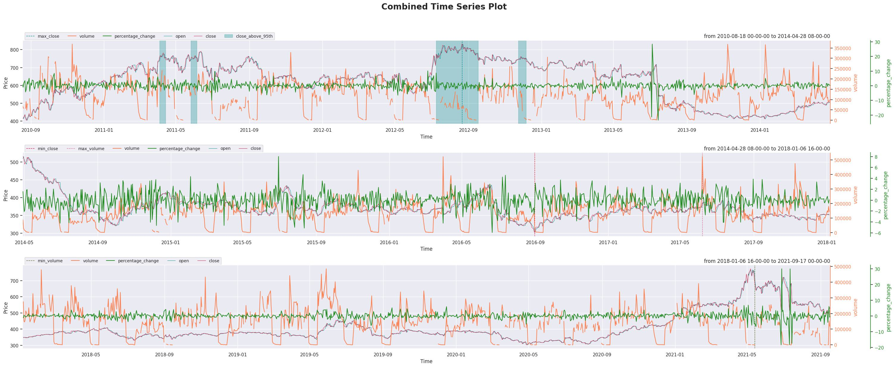
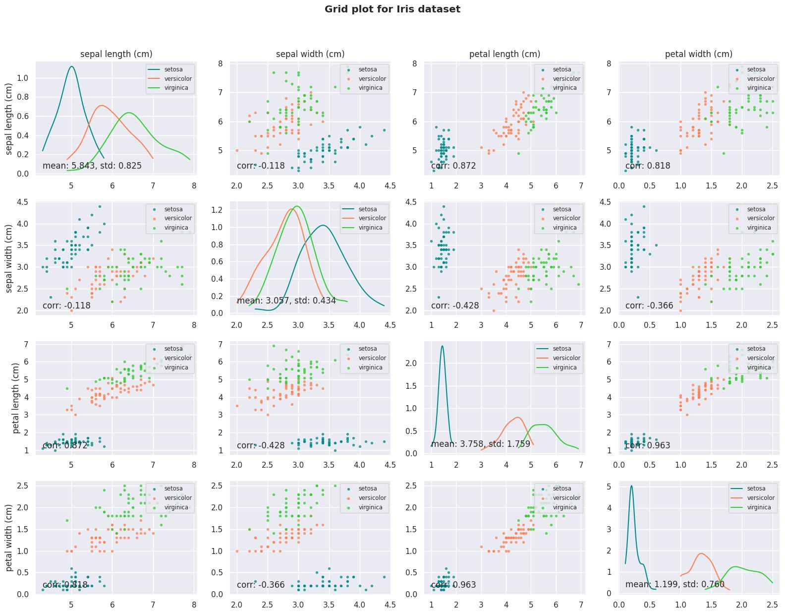
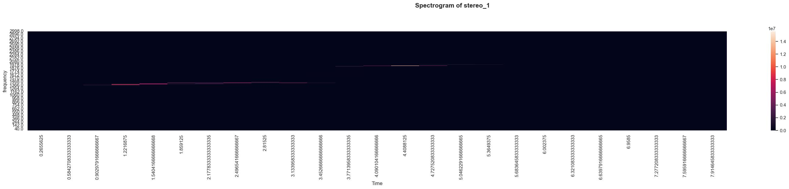
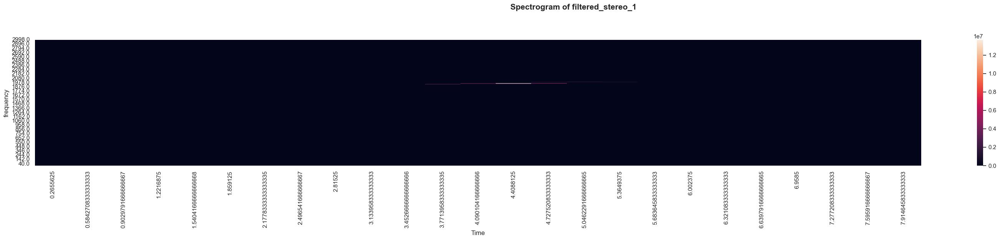

msdlib
======

.. image:: ../msdlib_logo_fit.png
    :width: 20%
==================================

.. image:: https://img.shields.io/pypi/l/msdlib.svg
.. image:: https://badge.fury.io/py/msdlib.svg
.. image:: https://travis-ci.org/abdullah-al-masud/msdlib.svg?branch=master
.. image:: https://readthedocs.org/projects/pip/badge/?version=latest
============================================================================

==============================================================================

.. automodule:: msdlib
   :members:
   :undoc-members:
   :show-inheritance:

Introduction
-------------
The main purpose of this library is to make data science works easier and simpler with less amount of coding, providing helper functions for plotting, 
ML training, evaluation, result summarization etc. 
The purpose is to focus more on making common tasks easier so that a beginner to mid level developer is able to do his/her jobs easily and can get started career with enough pace.

Dependencies
-------------
- Numpy
- Pandas
- Matplotlib
- Scipy
- Seaborn
- joblib
- Pytorch (for mlutils package)

All of these packages except Pytorch will be installed automatically during msdlib installation.

Pytorch should be installed by following installation procedure suggested `here <https://pytorch.org/>`_.

Installation
-------------
``pip install msdlib``

or if you have --user related issues during installation, please use

``pip install --user msdlib``

License
--------
MIT open source License has been issued for this library.

Examples
---------
You can find easy examples on how to use the functions and classes from this library `here <https://github.com/abdullah-al-masud/msdlib/tree/master/examples>`_.
Necessary data is also provided in this directory.

Documentation
--------------
Complete documentation of classes and functions can be found here https://msdlib.readthedocs.io/.

Call for contributions
-----------------------

We seek active participation of enthusiastic developers from around the world to enrich this library more, adding more functionalities from different aspects,
giving more flexibility, completing unfinished functionalities and maintain the library in regular manner. 
We would be grateful for your invaluable suggestions and participations.

Overview
---------

The whole library can be divided into 4 main portions.

1. Machine learning tools
2. Visualization tools
3. Data processing tools
4. Fintech and Miscellaneous

Some of the frequently used programs are shown bellow.

1. Machine Learning Tools
--------------------------

--------
mlutils:
--------
This module provides functionalities for easier implementation of Pytorch Deep Learning models. It offers several facilities such as-

    - Scikit-like easy implementation of Pytorch models using fit, predict and evaluate methods
    - Constructing Deep Learning models in a few lines of code
    - Producing automated results with beautiful tables having precision, recall, f1_score, accuracy and specificity in classification problems
    - Producing automated graphs of true-vs-prediction and result preparation for regression model

Examples are available for regression, binary and multi-class classification models `here <https://github.com/abdullah-al-masud/msdlib/tree/master/examples>`_.

---------------
paramOptimizer:
---------------
This is a class which can conduct easy Hyper-parameter optimization process. 
Currently it enables us to apply grid search and random search for any model/function/mathematical entity

-------------
SplitDataset:
-------------
This is one of the most useful classes in this library. It enables us to split data set into train, validation and test sets. 
We have three options here to split data set-

    - random_split
    - cross_validation_split
    - sequence_split (specially necessary for RNN/LSTM)

Examples are available `here <https://github.com/abdullah-al-masud/msdlib/tree/master/examples>`_.

-----------------
one_hot_encoding: 
-----------------
This function converts classification labels in one hot encoded format

------------------
feature_evaluator:
------------------
This function is one of the most useful tools. It can calculate feature importance from statistical point of view. 
It can show the results using bar plot and can handle classification and regression both kind of labels.

-------------
class_result: 
-------------
This function calculates classification model evaluation parameters like precision, recall, accuracy, f1 score, specificity etc. and also able to show confusion matrix as a pandas dataframe.
Example is available `here <https://github.com/abdullah-al-masud/msdlib/tree/master/examples/class_result_example.py>`_.

-------------
rsquare_rmse: 
-------------
This function calculates r square value and root mean square error.

2. Visualization Tools
----------------------

--------------
data_gridplot:
--------------

Its a function for scatter plots between every pair of features along with distributions (similar to matrix_plot in pandas). But it enables you to save the image, change figure_size, titles etc and also has one special feature for clusters in the data if any.
Example is available `here <https://github.com/abdullah-al-masud/msdlib/tree/master/examples/data_grid_plot_example.py>`_.

-----------------
plot_time_series:
-----------------

This is one of the the most useful functions in this library. It helps to plot time series data with a lot of flexibility. It helps to plot time series data with a lot of flexibility. Please check out the example scripts for illustrations and guidance to use it.
Example is available `here <https://github.com/abdullah-al-masud/msdlib/tree/master/examples/plot_time_series_example.py>`_.

-------------
plot_heatmap:
-------------
Flexible heatmap plotter function with options to remove symmetrical triangular side and several other options.

3. Data Processing Tools
------------------------

--------
Filters:
--------

.. image:: ../examples/filters_and_spectrogram_example/recorded_signal.jpg
.. image:: ../examples/filters_and_spectrogram_example/filter_spectrum.jpg
.. image:: ../examples/filters_and_spectrogram_example/Frequency_Spectrum_of_filtered_stereo_1.jpg
.. image:: ../examples/filters_and_spectrogram_example/filtered_stereo_1_with_bp_filter_with_cut_offs_[1800._2500.].jpg

This is a class defined for applying low pass, high pass, band pass and band stop filters. It also enables us to visualize frequency domain of the signal, designed filter and also let us visualize the filtered signal if we apply a filter on the signal.
Example is available `here <https://github.com/abdullah-al-masud/msdlib/tree/master/examples/filters_and_spectrogram_example.py>`_.

----------------
get_spectrogram:
----------------

This is a function that allows us to calculate spectrogram of any time series signal and also plots heatmap for that spectrogram with proper frequency bins and time axis.
Example is available `here <https://github.com/abdullah-al-masud/msdlib/tree/master/examples/filters_and_spectrogram_example.py>`_.

4. Fintech & Miscellaneous
--------------------------

--------------------------------
msdbacktest (under development):
--------------------------------
This module intends to provide helper functionalities for trading automation, strategy implementation, back-testing, 
evaluating strategy by different popular ratios like maximum drawdown, calmar ratio, sharpe ratio etc.
Currently only a few functionalities are available and is still under development.

------------
ProgressBar:
------------

This is a custom progress bar which shows loop progress with a visual bar along with other information like elapsed and remaining time, loop count, total count, percentage of completion etc. (You should only use it if you dont print anything inside your loop)
Example can be found `here <https://github.com/abdullah-al-masud/msdlib/tree/master/examples/ProgressBar_example.py>`_.

Reference/citation
-------------------

.. code:: bibtex

    @manual{msdlib,
    title="{msdlib}: A package for easier data science practices",
    author="{Abdullah Al Masud and {msdlib Developers}}",
    year=2020,
    month=Jan,
    url="{https://github.com/abdullah-al-masud/msdlib}"
    }
